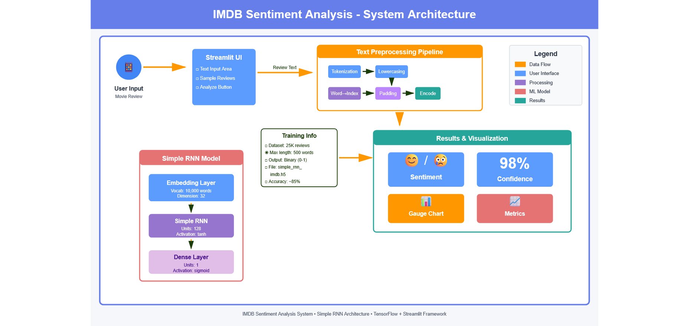
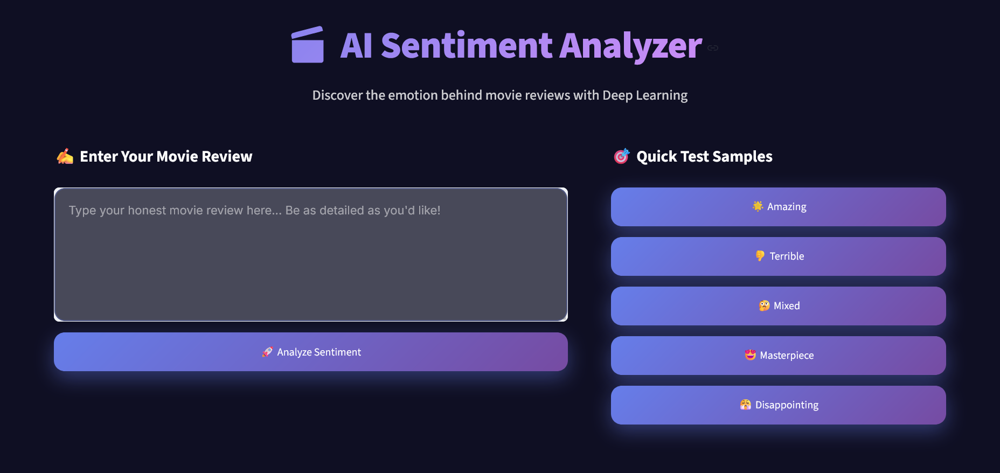
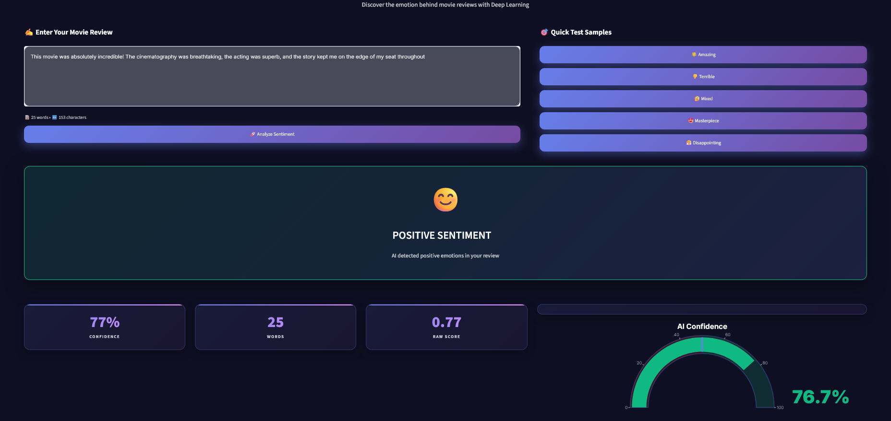

# 🎬 IMDB Sentiment Analyzer

A machine learning-powered web application that predicts sentiment (Positive/Negative) of movie reviews using Deep Learning with Simple RNN architecture and a modern dark-themed interface.


## 📋 Table of Contents

- [Overview](#overview)
- [Features](#features)
- [System Architecture](#system-architecture)
- [Installation](#installation)
- [Usage](#usage)
- [Screenshots](#screenshots)
- [Troubleshooting](#troubleshooting)
- [Technologies Used](#technologies-used)
- [License](#license)

## 🌟 Overview

This project uses a Simple Recurrent Neural Network (RNN) trained on 25,000 IMDB reviews to automatically classify movie reviews as positive or negative. The application features a modern dark-themed interface with real-time predictions and interactive visualizations.

**Key Stats:**
- **Model**: Simple RNN with 128 units
- **Training Data**: 25,000 IMDB reviews
- **Accuracy**: ~85%
- **Inference Time**: < 1 second

## ✨ Features

- 🤖 **Real-time Sentiment Prediction** - Instant positive/negative classification
- 📊 **Interactive Visualizations** - Beautiful gauge charts and animated results
- 🎯 **Sample Reviews** - 5 pre-loaded examples for quick testing
- 🎨 **Modern Dark UI** - Sleek glassmorphism design with purple gradients
- 📈 **Confidence Scoring** - Percentage-based confidence metrics
- ⚡ **Fast Performance** - Sub-second predictions after initial load

## 🏗️ System Architecture



**Data Flow:**
```
User Input → Streamlit UI → Preprocessing Pipeline → Simple RNN Model → Results Display
```

**Components:**
1. **User Input**: Web interface for entering reviews
2. **Preprocessing**: Tokenization → Lowercasing → Word2Index → Padding (500) → Encoding
3. **RNN Model**: Embedding (32d) → Simple RNN (128 units) → Dense (sigmoid)
4. **Results**: Sentiment + Confidence + Gauge Chart + Metrics

## 🚀 Installation

### Quick Start

```bash
# 1. Clone repository
git clone the repo
cd imdb-sentiment-analyzer

# 2. Create virtual environment
python -m venv venv
source venv/bin/activate  # On Windows: venv\Scripts\activate

# 3. Install dependencies
pip install -r requirements.txt

# 4. Run application
streamlit run main.py
```

### Requirements

```txt
streamlit
tensorflow
numpy
plotly
```

## 💻 Usage

### Running the App

```bash
streamlit run main.py
```

The app will open at `http://localhost:8501`

### How to Use

1. **Enter Review**: Type your movie review in the text area
2. **Or Use Samples**: Click any sample button (🌟 Amazing, 👎 Terrible, etc.)
3. **Analyze**: Click "🚀 Analyze Sentiment" button
4. **View Results**: See sentiment, confidence, gauge chart, and metrics

### Example Input

**Positive Review:**
```
This movie was absolutely incredible! The cinematography was breathtaking, 
the acting was superb, and the story kept me engaged throughout.
```

**Negative Review:**
```
What a waste of time. Poor acting, predictable plot, and terrible pacing. 
Would not recommend.
```

## 📸 Screenshots

### Home Page

*Modern dark interface with text input and sample reviews*

### Prediction Results

*Real-time sentiment analysis with confidence metrics and gauge chart*

## 🔧 Troubleshooting

### Common Issues

#### 1. ModuleNotFoundError: plotly

**Solution:**
```bash
pip install plotly
# Or install all dependencies:
pip install -r requirements.txt
```

---

#### 2. Model File Not Found

**Error:** `No such file or directory: 'simple_rnn_imdb.h5'`

**Solution:**
- Ensure `simple_rnn_imdb.h5` is in the same directory as `main.py`
- Check file name (case-sensitive)
- Verify file size (~16MB)

---

#### 3. Port Already in Use

**Error:** `Address already in use`

**Solution:**
```bash
# Option 1: Kill process
lsof -ti:8501 | xargs kill -9  # Mac/Linux
netstat -ano | findstr :8501   # Windows (then taskkill)

# Option 2: Use different port
streamlit run main.py --server.port 8502
```

---

#### 4. Text Not Visible

**Issue:** Can't see typed text in input area

**Solution:** Already fixed in latest version. If issue persists:
- Clear browser cache (Ctrl + Shift + R)
- Try incognito/private mode

---

#### 5. Slow First Load

**Issue:** App takes 10-20 seconds to load initially

**Explanation:** This is normal - TensorFlow model loading (~16MB) takes time on first run. Subsequent predictions are instant (< 1 second).

---

#### 6. TensorFlow Warnings

**Warning:** `FutureWarning` or `DeprecationWarning`

**Solution:** These are harmless and can be ignored. To hide:
```python
import warnings
warnings.filterwarnings('ignore')
```

---

### Debugging Commands

```bash
# Check Python version
python --version  # Should be 3.8+

# Verify installations
pip list | grep -E "streamlit|tensorflow|plotly"

# Test Streamlit
streamlit hello

# Check if port is free
lsof -i :8501  # Mac/Linux
netstat -ano | findstr :8501  # Windows
```

## 🛠 Technologies Used

| Category | Technology | Purpose |
|----------|-----------|---------|
| **ML/Backend** | TensorFlow 2.13+ | Deep learning framework |
| | Keras | Neural network API |
| | NumPy | Numerical computing |
| **Frontend** | Streamlit 1.28+ | Web framework |
| | Plotly 5.17+ | Interactive charts |
| **Model** | Simple RNN | Sentiment classification |
| | Embedding Layer | Word representations |

## 📊 Model Details

| Parameter | Value |
|-----------|-------|
| Architecture | Simple RNN |
| Vocabulary Size | 10,000 words |
| Embedding Dimension | 32 |
| RNN Units | 128 |
| Max Sequence Length | 500 tokens |
| Training Data | 25,000 IMDB reviews |
| Accuracy | ~85% |
| Model Size | 16MB |

## 🔮 Future Improvements

- [ ] Add LSTM/GRU model options
- [ ] Multi-language support
- [ ] Batch processing for multiple reviews
- [ ] Export results (PDF/CSV)
- [ ] Review history tracking
- [ ] API endpoints
- [ ] Word importance highlighting
- [ ] Mobile app version

## 📄 License

MIT License - see [LICENSE](LICENSE) file for details.

**What this means:**
- ✅ Commercial use allowed
- ✅ Modification allowed
- ✅ Distribution allowed
- ⚠️ No warranty provided

## 👥 Author

**Pinki**
- Email: Pinkidagar18@gmail.com

## 🙏 Acknowledgments

- **IMDB Dataset**: Stanford University
- **TensorFlow Team**: Deep learning framework
- **Streamlit Team**: Web app framework
- **Open Source Community**: Inspiration and support


## ⚠️ Disclaimer

This project is for educational purposes. Model accuracy is ~85% and may struggle with sarcasm, very short reviews, or mixed sentiments. Not suitable for production without validation.

---

<div align="center">

**Made with 💜 for movie enthusiasts and AI learners**

⭐ **Star this project if you found it helpful!** ⭐


</div>
